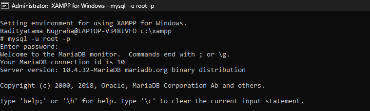
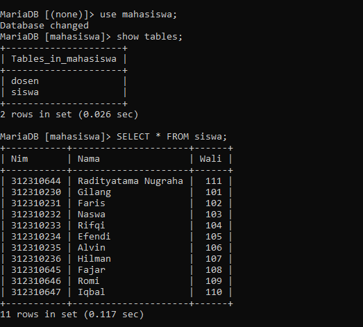
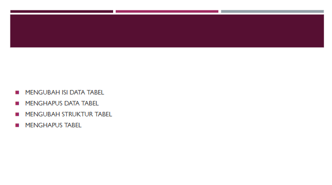
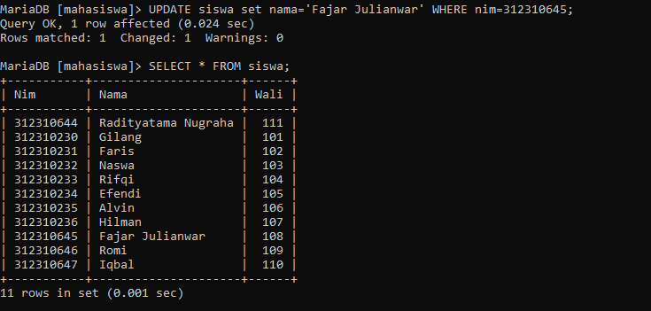
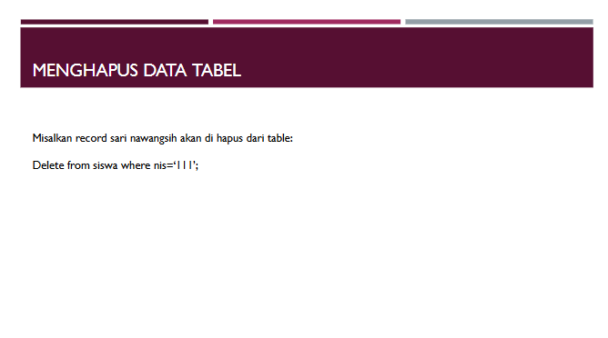
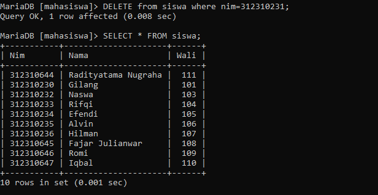
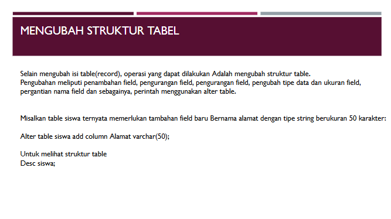
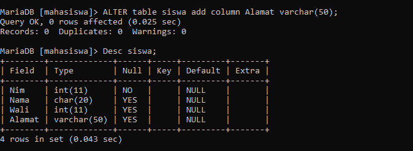
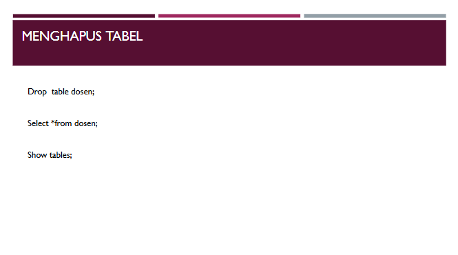
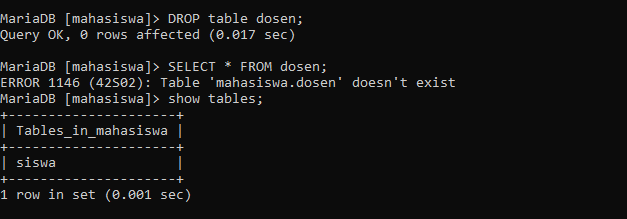

# Tugas Praktikum 4 (Pertemuan ke 5) 

|Nama|NIM|Kelas|Mata Kuliah|
|----|---|-----|------|
|**Radityatama Nugraha**|**312310644**|**TI.23.A3**|**Manajemen Basis Data**|

## - Untuk Memulai Codingan Database di XAMPP dan ke Shell

## - Menampilkan daftar tabel dan seluruh data dari tabel siswa di database mahasiswa dengan perintah USE mahasiswa;, SHOW TABLES;, dan SELECT * FROM siswa;.

# Soal 1:

## - Mengubah nama mahasiswa dengan NIM 3123180645 menjadi Fajar Julianwar menggunakan UPDATE, lalu menampilkan seluruh data tabel siswa dengan SELECT * untuk memastikan perubahan berhasil.

# Soal 2:

## - Menghapus data mahasiswa dengan NIM 312310231 menggunakan DELETE, lalu menampilkan seluruh isi tabel siswa dengan SELECT * untuk memastikan data terhapus.

# Soal 3:

## - Menambahkan kolom baru bernama Alamat ke tabel siswa di database mahasiswa menggunakan perintah ALTER TABLE, lalu menggunakan DESC siswa; untuk menampilkan struktur tabel dan memastikan kolom berhasil ditambahkan.

# Soal 4:

## - Menghapus tabel dosen dengan DROP TABLE, lalu cek hasilnya dengan SELECT * dan SHOW TABLES untuk memastikan tabel sudah terhapus.

